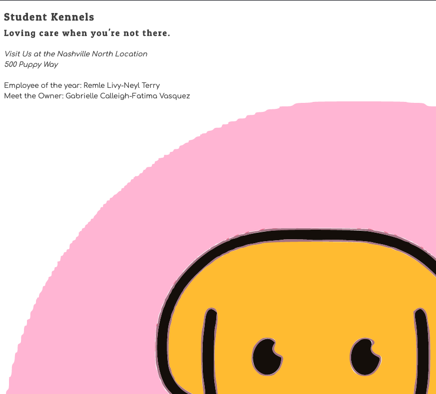

# React

Created: 2020-02-07 11:19:40 | Modified: 02-10-2020 16:09:58

*This assignment is from NSS's course Book: 4 [Directions here](directions.md)*

*This assignment uses React: [Directions on how to run app](reactDirections.md)*

Preview application here: https://trinity-react-kennel.netlify.com/

***

## Description
- This Application is the end product of a lesson teaching how to use React.
